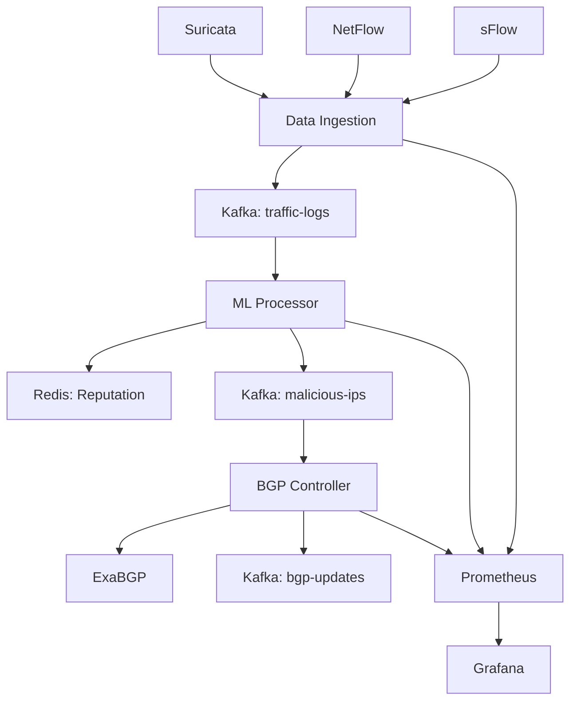

# Arquitetura Técnica - DDoS Mitigation Lab

## Visão Geral do Sistema

Sistema distribuído de detecção e mitigação DDoS baseado em arquitetura de microserviços, implementando pipeline de machine learning em tempo real com capacidades de resposta automática.

### Objetivos Arquiteturais
- **Detecção em tempo real**: Latência <200ms para classificação
- **Escalabilidade horizontal**: Processamento distribuído via Kafka
- **Alta disponibilidade**: Componentes stateless com failover automático
- **Modularidade**: Serviços independentes com APIs bem definidas

## Componentes da Arquitetura

### 1. Data Ingestion Service

**Localização**: `src/data-ingestion/`  
**Porta**: 8002  
**Função**: Coleta e normalização de dados de tráfego

#### Responsabilidades Técnicas
- Monitorização de logs Suricata (formato eve.json)
- Receção de dados NetFlow/sFlow via UDP
- Normalização e enriquecimento de dados
- Publicação em tópico Kafka `traffic-logs`
- Validação e sanitização de input

#### Stack Tecnológico
```python
# Componentes principais
- asyncio: Processamento assíncrono de I/O
- watchdog: Monitorização de sistema de ficheiros
- socket: Receção UDP para NetFlow
- kafka-python: Producer para streaming
- structlog: Logging estruturado
```

#### Fluxo de Dados
```
Suricata Logs → File Watcher → Parser → Kafka Producer
NetFlow Data → UDP Socket → Decoder → Kafka Producer
```

### 2. ML Processor (Core Engine)

**Localização**: `src/ml-processor/`  
**Porta**: 8000  
**Função**: Engine principal de detecção baseado em ML

#### Arquitetura de ML
```
Input → Feature Extraction → Ensemble Models → Decision → Output
         (77 features)     XGB + RF + IF     Logic    BGP Action
```

#### Modelos Implementados
- **XGBoost**: Classificação supervisionada (ataques conhecidos)
- **Random Forest**: Classificação robusta com feature importance
- **Isolation Forest**: Detecção de anomalias não supervisionada
- **Ensemble Logic**: Voting system com pesos adaptativos

#### Sistema de Hierarquia de Modelos
```
1. Modelos Otimizados (xgboost_optimized_simple.pkl)
2. Modelos Híbridos Avançados (hybrid_advanced_models.pkl)  
3. Modelo Simples (rf_model.pkl)
4. Modelos Default (não treinados)
```

#### Pipeline de Processamento
```python
def process_traffic_event(event):
    # 1. Feature engineering (77 features)
    features = extract_features(event)
    
    # 2. Ensemble prediction
    predictions = {
        'xgboost': xgb_model.predict(features),
        'random_forest': rf_model.predict(features),
        'isolation_forest': if_model.predict(features)
    }
    
    # 3. Decision logic
    threat_score = ensemble_decision(predictions)
    
    # 4. Reputation system
    update_ip_reputation(event.src_ip, threat_score)
    
    # 5. Action triggering
    if threat_score > threshold:
        publish_malicious_ip(event.src_ip)
```

### 3. BGP Controller

**Localização**: `src/bgp-controller/`  
**Porta**: 8001  
**Função**: Sistema de mitigação via BGP

#### Estratégias de Mitigação
- **BGP Blackholing**: Anúncios /32 para bloqueio cooperativo
- **Rate Limiting**: Controlo adaptativo baseado em reputação
- **Traffic Shaping**: Modelação de tráfego por prioridade

#### Protocolo BGP
```
Malicious IP → BGP Announcement → Peer Routers → Traffic Drop
             (0.0.0.0/0 next-hop)
```

```
Dados Brutos → Extração Features → Normalização → Modelos → Score → Reputação → Decisão
```

### 3. BGP Controller

**Localização**: `src/bgp-controller/`

**Responsabilidades**:
- Consome IPs maliciosos do Kafka (`malicious-ips`)
- Determina estratégia de mitigação:
  - **Blackhole**: Para ataques volumétricos
  - **Flowspec**: Para ataques específicos
- Gera anúncios BGP via ExaBGP
- Gerencia TTL automático para desanúncios

**Tecnologias**:
- ExaBGP para anúncios BGP
- Subprocess para controle de processo
- TTL Manager para expiração automática

#### Estratégias de Mitigação

| Tipo de Ataque | Estratégia | Ação BGP |
|-----------------|------------|----------|
| Volumétrico (>0.95 score) | Blackhole | Route null |
| Application Layer | Flowspec | Rate limiting |
| Protocol Anomaly | Flowspec | Filtering |
| Zero-day | Flowspec | Rate limiting |

### 4. Apache Kafka

**Tópicos**:
- `traffic-logs`: Dados normalizados de tráfego
- `malicious-ips`: IPs suspeitos com metadados
- `bgp-updates`: Anúncios BGP realizados

**Configuração**:
- 6 partições para `traffic-logs` (alta throughput)
- 3 partições para outros tópicos
- Retenção de 7 dias

### 5. Redis

**Uso**:
- Cache de features processadas
- Sistema de reputação de IPs
- Contadores de validação cruzada
- TTL automático para limpeza

**Estruturas**:
```
reputation:{ip} → {score, validations, last_seen, attack_types}
cache:features:{hash} → {processed_features}
stats:hourly:{timestamp} → {threats_detected, false_positives}
```

### 6. Monitoring Stack

**Localização**: `src/monitoring/`

#### Prometheus
- Coleta métricas de todos os componentes
- Alertas configurados para anomalias
- Retenção de 15 dias

#### Grafana
- Dashboards para visualização
- Alertas visuais
- Métricas em tempo real

**Métricas Principais**:
- Taxa de detecção de ameaças
- Latência ponta-a-ponta
- Taxa de falsos positivos
- Status dos anúncios BGP
- Performance dos modelos ML

## Fluxo de Dados



## Modelo de Dados

### Traffic Log (Normalizado)
```json
{
  "timestamp": "2024-01-01T10:00:00Z",
  "source": "suricata|netflow",
  "event_type": "alert|flow",
  "src_ip": "192.168.1.100",
  "dst_ip": "10.0.0.1",
  "src_port": 12345,
  "dst_port": 80,
  "protocol": "TCP|UDP|ICMP",
  "bytes": 1500,
  "packets": 10,
  "duration": 5.5,
  "raw_data": {...}
}
```

### Malicious IP
```json
{
  "ip": "192.168.1.100",
  "threat_score": 0.85,
  "reputation_score": 0.75,
  "attack_type": "syn_flood",
  "confidence": 0.90,
  "detection_method": "supervised",
  "timestamp": "2024-01-01T10:00:00Z",
  "ttl": 3600,
  "validations": 3
}
```

### BGP Update
```json
{
  "action": "announce|withdraw",
  "ip": "192.168.1.100",
  "route_type": "blackhole|flowspec",
  "strategy": "blackhole",
  "attack_type": "syn_flood",
  "threat_score": 0.85,
  "timestamp": "2024-01-01T10:00:00Z",
  "ttl": 3600
}
```

## Escalabilidade

### Horizontal Scaling
- **Kafka**: Aumentar partições para maior paralelismo
- **ML Processor**: Múltiplas instâncias com grupos de consumidores
- **Redis**: Cluster mode para alta disponibilidade

### Vertical Scaling
- **ML Processor**: Mais CPU/RAM para modelos complexos
- **BGP Controller**: SSD para logs de alta frequência

### Performance Targets
- **Latência**: < 5 segundos da detecção ao anúncio BGP
- **Throughput**: > 100k eventos/segundo
- **Disponibilidade**: 99.9% uptime

## Segurança

### Autenticação
- TLS para comunicação Kafka
- Redis AUTH para acesso ao cache
- API Keys para componentes externos

### Isolamento
- Containers Docker com limites de recursos
- Network policies para comunicação entre serviços
- Volumes separados para dados sensíveis

### Auditoria
- Logs estruturados em todos os componentes
- Rastreamento de todas as decisões de bloqueio
- Métricas de segurança no Prometheus
